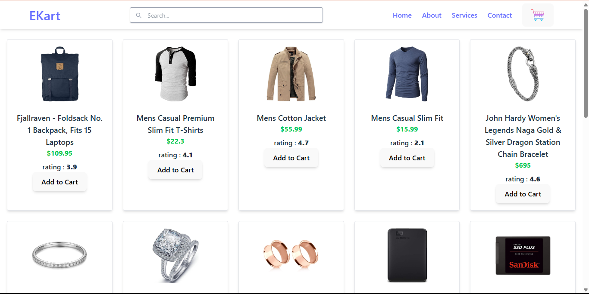
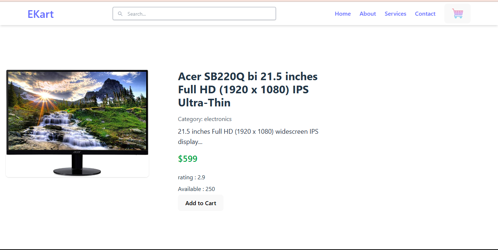
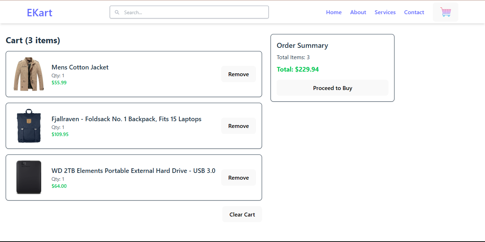

# 🛒 eKart – Your Online Shopping Solution

eKart is a full-featured e-commerce web application that lets users browse products, add items to their cart, and place orders with ease. Built with a modern tech stack for seamless shopping experiences.

## 🚀 Features

- 🛍️ Product listing with images, prices, and descriptions
- 🔍 Search and filter functionality
- 🛒 Add to cart and remove from cart
- 💳 Checkout page
- 🔐 User authentication (login/signup)
- 📦 Order history
- 🌐 Responsive design

## 📸 Screenshots

### 🏠 Home Page


### 🛍️ Product Page


### 🛒 Cart Page


### 🔐 Login Page


## 🧰 Tech Stack

- Frontend: React.js 
- Backend: Node.js + Express
- Database: MongoDB /  SQL
- Deployment: Vercel 

## 🛠️ Installation

```bash
# Clone the repo
git clone https://github.com/your-username/ekart.git
cd ekart

# Install dependencies
npm install

# Run the app
npm run dev

#Folder Structure
ekart/
│
├── public/
├── src/
│   ├── components/
│   ├── pages/
│   ├── App.jsx
│   └── app.css
├── screenshots/
│   ├── home.png
│   ├── product.png
│   └── ...
├── package.json
└── README.md
